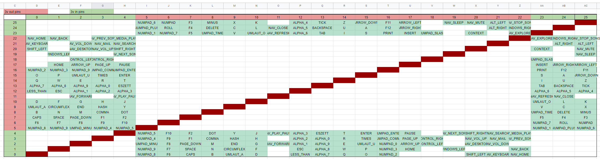

The codebase should be fairly adaptable, but you'll have to map out your keyboard-matrix on your own.

Depends on
* [`adafruit_hid`](https://circuitpython.org/libraries)
* [`German Keyboard Layout`](https://github.com/Neradoc/Circuitpython_Keyboard_Layouts)

 

## Additional Resources

To generate the keyboard matrix, you can use [this spreadsheet](https://docs.google.com/spreadsheets/d/1UPQMnKelYr9f5ZtArrkLHAALaYuC5VrK4pNIPA3vo14/edit#gid=2100433240)
paired with [this script](_readme/script/picoPolling.py) to gather the pin-numbers for each key.

Then just paste the script output to the `Key | Pin_A | Pin_B` section, and you'll receive a matrix like this:

Now configure the `in_pins` and `out_pins` on the right (make sure to mirror these to [code.py](code.py) `inPinIDXs` and `outPinIDXs`).

The spreadsheet will generate a list of `funcs` and a `key_map` that you can copy to [KeyMapper.py](KeyMapper.py)

 

### Ghosting

This program assumes that your keyboard has no protections against ghosting.  

For example, given the matrix above, pressing `X`, `K` and `Y` will cause ghosting on `J` (meaning `J` is detected as pressed, even if it is not).

Since it is not possible to distinguish between `Y` and `J` when both `X` and `K` are pressed, `Y` and `J` are ignored, until `X` or `K` are released.

If your keyboard does protect against ghosting (e.g. by using diodes for each switch), you can simply strip ghosting detection from [code.py](code.py).
